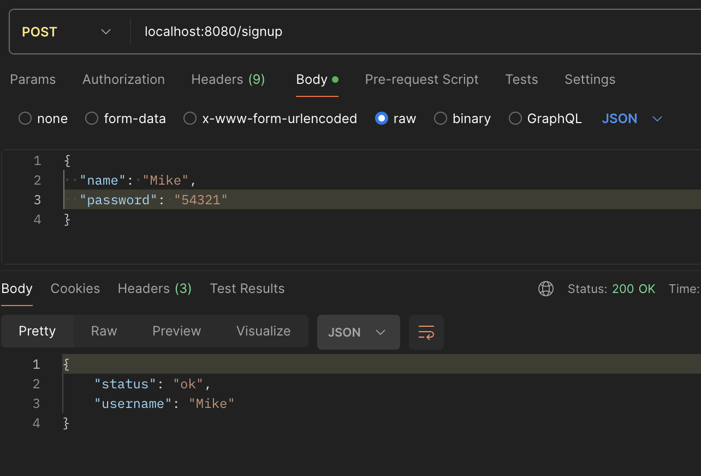
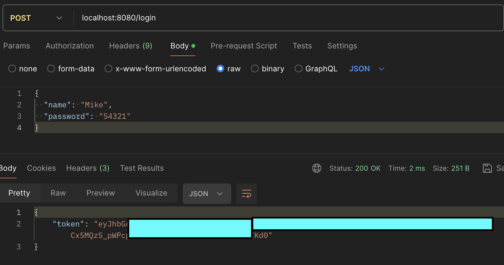
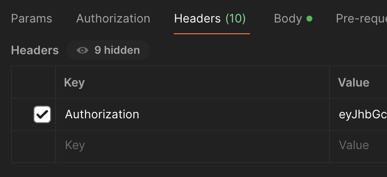
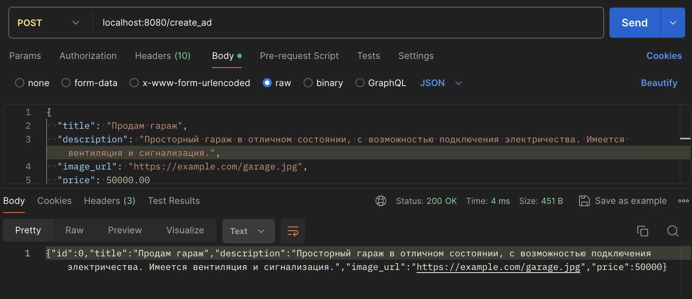
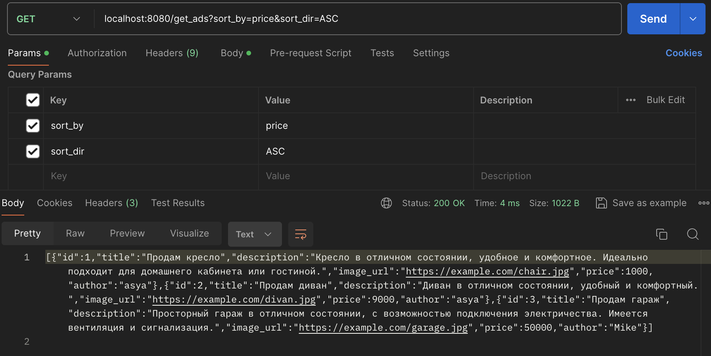
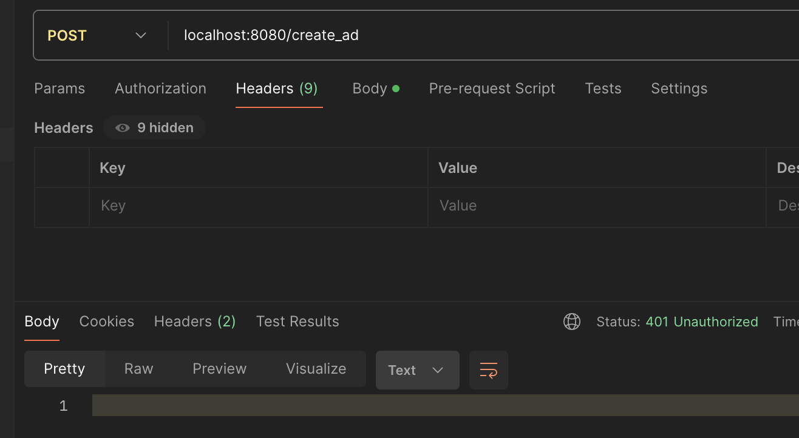

# Marketplace API
Test task for VK

Api состоит из 4 эндпоинтов:

- `/signup` - регистрация пользователя
- `/login` - авторизация пользователя
- `/create_ad` - создание объявления
- `/get_ads` - получение объявлений

## Запуск

Для запуска Api необходимо запустить команду

```sh
make
```

## Работа с API

Для регистрации пользователя необходимо отправить POST запрос с телом `{"name": "username", "password": "password"}` на адрес [`localhost:8080/signup`](http://localhost:8080/signup)



После этого нужно авторизоваться и получить токен. Для этого отправить POST запрос на адрес [`localhost:8080/login`](http://localhost:8080/login) с телом `{"name": "username", "password": "password"}`



Если логин и пароль верны, то сервер вернет токен. Токен нужно добавлять во все последующие запросы в заголовке `Authorization: <токен>`.



Для создения нового объявления необходимо отправить POST запрос с телом `{"title": "title", "description": "description", "image_url": "image_url", "price": "price"}` на адрес [`localhost:8080/create_ad`](http://localhost:8080/create_ad)



Для получения объявлений необходимо отправить GET запрос на адрес [`localhost:8080/get_ads`](http://localhost:8080/get_ads)
В параметрах можно передавать `?page=<номер страницы>` (для пагинации), `?sort_by=<поле>` и `sort_dir=<направление сортировки>` (для сортировки).



## Негативный тест-кейс

При попытке создать объявление без токена авторизации должен вернуться код 401.

